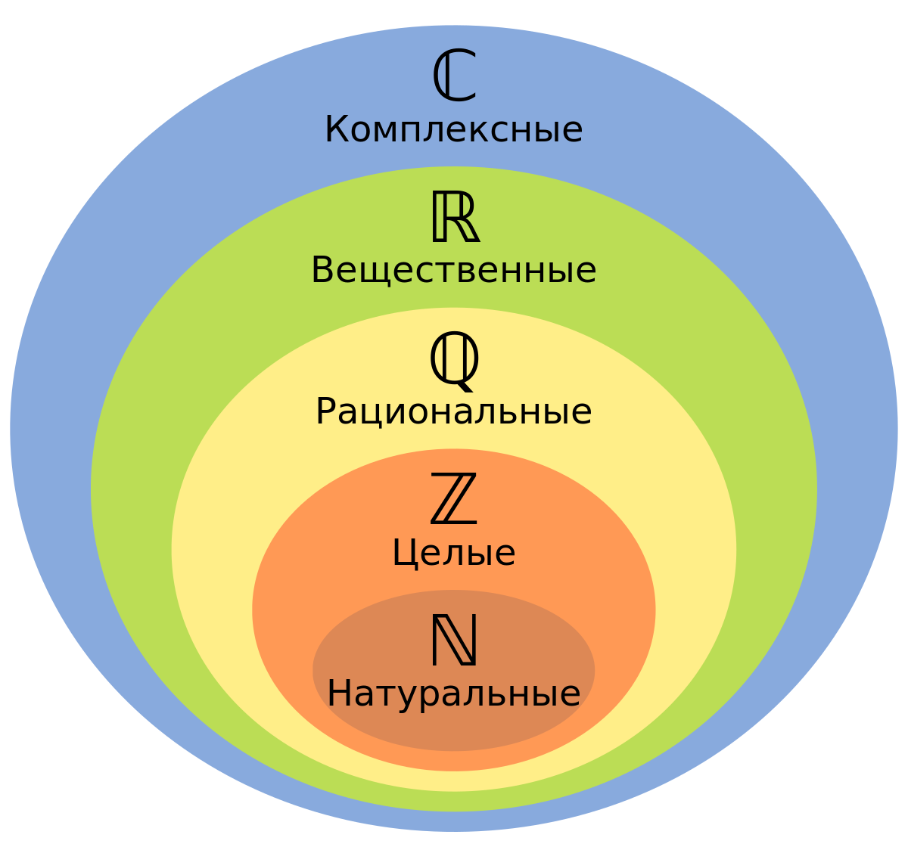

# Множества

## Базовые определения

### Определение множества(Set)

**Множество** - это коллекция объектов любого типа: люди, книги, цифры, строки и т.д. \
**Множество** - это _неупорядоченная_ коллекция _уникальны_х объектов.\
Множество является неупорядоченным, то есть при генерации множества, элементы множества могут быть расставлены в любом порядке, в том числе и в упорядоченном варианте.&#x20;

#### Примеры:

$$
E=\{2,4,6,8\}
$$

$$
V = \{ a,e,i,o,u\}
$$

### Кардинальность множества(Cardinality)

**Кардинальность множества -** это количество элементов в множестве $$S$$. Обозначается как $$|S|$$

#### Примеры:

$$
\mid E \mid = 4
$$

$$
\mid V \mid = 5
$$

### Принадлежность

$$
\in Обозначает \space \space принадлежность \space элемента \space множеству
$$

$$
\notin Обозначает \space \space отсутствие \space принадлежности \space элемента \space множеству
$$

### Пустое множество(Empty set)

**Пустое множество (empty set)** - это такое множество в котором нет элементов. <mark style="background-color:orange;">Пустое множество принадлежит любому множеству, даже пустому.</mark> $$\empty$$ обозначает пустое множество.

$$
\empty=\{\}
$$

<mark style="background-color:orange;">Кардинальность пустого множества равна нулю</mark>

$$
|\empty|=0
$$

$$
\empty \in \empty
$$

### Подмножество(Subset)

Пусть есть множество $$A$$ тогда множество $$B$$ будет являться подмножеством $$A$$, тогда и только тогда, когда все элементы множества $$B$$ будут присутствовать в множестве $$A$$.&#x20;

$$
A \sub B \space обозначает, что \space A \space является \space подмножеством \space B
$$

Существует два типа подмножеств **строгое подмножество(строгое включение)** и **нестрогое подмножество(нестрогое включение)**

$$
\sub \space Обозначает \space строгое \space подмножество
$$

$$
\sube \space Обозначает \space нестрогое \space подмножество
$$


Примечание автора:

В международном стандарте используется еще второй вариант обозначений, при этом оба варианта находятся в одном стандарте ISO 31-11. Из-за этого получается путаница. В дальнейшем будет использоваться только обозначения указанные выше.


**Нестрогое подмножество** - это такое подмножество, что допускает равенство множества и подмножества то есть если $$A \subseteq B$$то допускается $$A = B$$.

**Строгое подмножество** - то такое подмножество, что не допускает равенство множества и подмножества то есть если $$A \subset B$$то в $$B$$есть элементы, который нет в $$A$$

### Множества N, Z, Q, R

$$N$$ - множество натуральных чисел $$\{ 1,2,3,4,...\}$$

$$Z$$ - множество целочисленных чисел $$\{...,-3,-2,-1, 0,1,2,3,...\}$$

$$Q$$- множество рациональных чисел(все числа определенные по формуле $$a/b$$ где $$b \not = 0$$

$$R$$ - Множество вещественных чисел. Это такое множество которое включает в себя множество рациональных и иррациональных чисел. Иррациональные числа это - $$\sqrt{2}, \sqrt{3}$$ и другие числа, которые невозможно выразить в форме деления двух целых чисел.&#x20;

$$
N\subseteq Z \subseteq Q \subseteq R
$$

<figure><figcaption><p>Рисунок 1. Отображение множеств на диаграмме Венна</p></figcaption></figure>

### Варианты построения множеств: Listing method, Set builder notation

Listing method представляет из себя обычное перечисление элементов множества. Например:

Множество $$S$$это все гласные буквы английского алфавита

$$
S = \{a,e,o,u,e\}
$$

Множество $$S$$это все четные положительные цифры до десяти

$$
S=\{2,4,6,8\}
$$

Set builder notation подходит больше для множеств, которые имеют множество элементов или бесконечное количество элементов. Например:

Множество $$A$$ это все четные цифры

Listing method выглядел бы следующим образом:

$$
A = \{...,-4.-2,0,2,4,6,...\}
$$

Set builder notation выглядел бы следующим образом:

$$
A = \{2 * n|n \in Z\}
$$

При построение set builder notation использовалось множество $$Z$$чисел, т.к. в множество входят как отрицательные, так и положительные числа. А если любое целое число умножить на 2, то оно станет четным. Таким образом при генерации, получается множество целых чисел. Set builder notation нашел свое применения в генераторах в python, когда мы объявляем элементы списка следующим образом:


```python
example = [i * 2 for i in range(10)]
```


Пример построения нечетных числе с помощью set builder notation

$$
B=\{2*n + 1|n \in Z\}
$$

Пример построения убывающей геометрической прогрессией с шагом 2

$$
Q=\{a/b|a,b \in Z and \space b \not = 0\}
$$

### Множество всех подмножеств(Powerset)

**Множество всех подмножеств(PowerSet) -** пусть дано множество $$S$$, тогда **powerset** множества $$S$$, это множество, которое содержит все допустимые подмножества, множества $$S$$. Обозначается как $$P(S)$$ где $$S$$ это множество. Пример:

$$
A=\{1,2,3\} \space тогда\space P(A) = \{\empty, \{1\}, \{2\},\{3\},\{1,2\}, \{1,3\}, \{2,3\}, \{1,2,3\}\}
$$

Если посмотреть на пример, то можно заметить, $$|P(A)| = 8$$, $$|A| = 3$$. <mark style="background-color:orange;">Тут есть закономерность: Мощность конечного множества подмножеств</mark> $$2^n$$ <mark style="background-color:orange;">где</mark> $$n$$ <mark style="background-color:orange;">это количество элементов в базовом множестве.</mark>&#x20;

## Операции над множествами

### Объединение (union)

Пусть даны два множества $$A$$ и $$B$$. $$A\cup B$$ является операцией **объединения** и включает в себя все элементы из $$A$$ или $$B$$.

$$
A \cup B = \{x|x \in A \space or \space x \in B \}
$$

Пример:

$$
A = \{\colorbox{red}{2,4,6,8}\} \space B=\{\colorbox{aqua}{1,3,5,7,9}\} \space A \cup B = \{\colorbox{red}{2,4,6,8},\colorbox{aqua}{1,3,5,7,9}\}
$$

Таблица истинности для такой операции будет выглядеть следующим образом:

|  A  |  B  | A ∪ B |
| :-: | :-: | :---: |
|  F  |  F  |   F   |
|  F  |  T  |   T   |
|  T  |  F  |   T   |
|  T  |  T  |   T   |

### Пересечение (Intersection)

Пусть даны два множества $$A$$ и $$B$$, пересечение множеств обозначается как $$A \cap B$$ и содержит элементы находящиеся в двух множествах одновременно.

$$
A \cap B = \{x|x \in A \space and \space x \in B \}
$$

$$
A = \{\colorbox{red}{2,4,\colorbox{green}3,6,\colorbox{green}7}\} \space B=\{\colorbox{red}{1,\colorbox{green}3,5,\colorbox{green}7,9}\} \space A \cup B = \{\colorbox{green}{3,7}\}
$$

| A | B | A ∩ B |
| - | - | ----- |
| F | F | F     |
| F | T | F     |
| T | F | F     |
| T | T | T     |

